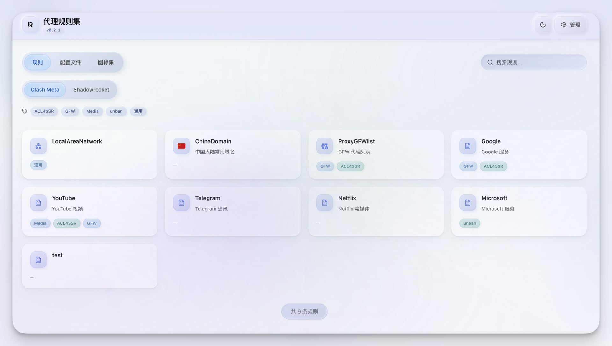
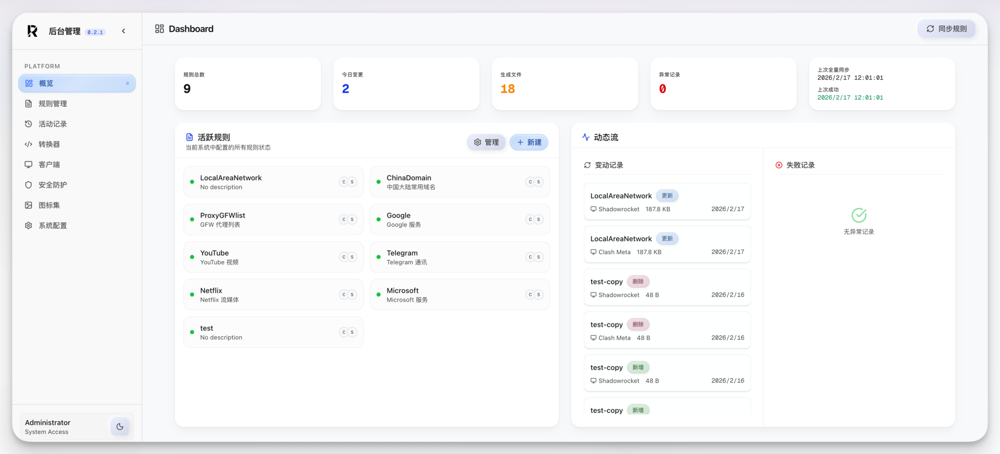
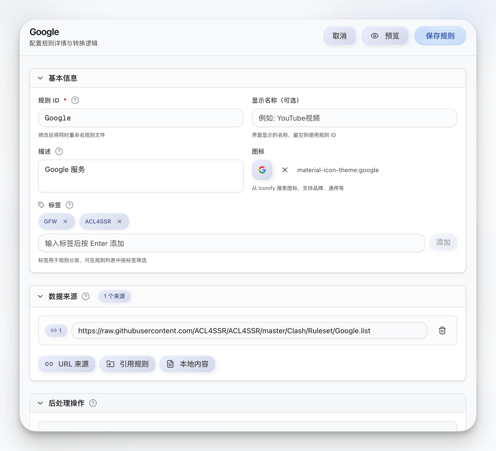

<p align="center">
  
</p>

# Proxy Rule Manager

面向代理规则与客户端配置的管理平台，提供规则编辑、客户端管理与公开分发。

## 预览

<p align="center">
  
</p>

<p align="center">
  
</p>

<p align="center">
  
</p>

## 功能

- 规则编排与自动化管理，支持本地 / 远程 / 引用 / Geosite 多种数据源混合
- JS 自定义转换器（goja 沙箱执行，内置 `console` / `atob` / `btoa` /
  `URL` / `URLSearchParams` / `TextEncoder` / `TextDecoder` / `helpers.*`）
  + 内置 `replace` / `remove_lines`
- 规则更新记录与差异追溯
- 客户端配置文件编辑与管理
- 公开分享与下载
- 数据源定时同步（interval / cron）
- WAF 速率限制 + IP 封禁
- 完整数据库备份与恢复
- 系统级参数（抓取超时 / 输出体积上限 / 速率限制等）可在 UI 调整并随备份保存

---

## ⚠️ 从 TypeScript 后端升级（≤ 0.3.x）

本版本是 Node.js → Go 的完整重写，**数据库格式不兼容**。
项目附带迁移脚本 `scripts/migrate-legacy-backup.sh`，可把旧版导出的备份 zip
重写为新版可直接 restore 的格式。

### 升级流程

1. **在旧版**：管理面板 → 系统配置 → 数据库备份与恢复 → 备份数据库
   会下载 `proxy-rule-manager-backup-YYYY-MM-DD.zip`。
2. **本机**：跑迁移脚本（需要 `python3` / `unzip` / `zip`）：
   ```bash
   ./scripts/migrate-legacy-backup.sh proxy-rule-manager-backup-YYYY-MM-DD.zip
   # 输出：proxy-rule-manager-backup-YYYY-MM-DD-migrated.zip
   ```
   脚本会同时打印迁移摘要（规则 / 客户端 / 转换器 / 数据源 / 客户端文件 / 同步元数据）。
3. **部署新版**：替换镜像 / 二进制，启动新服务（admin token 会自动生成，见启动日志）。
4. **新版**：管理面板 → 系统配置 → 数据库备份与恢复 → 恢复数据库
   上传上一步生成的 `*-migrated.zip` 即可。
5. **首次同步**：管理面板 → 触发一次全量同步以重新生成 `Rules/` 输出。

### 迁移脚本会带过来什么

- `config`：全部规则、转换器（含自定义 JS 脚本）、客户端覆盖、合并策略
- `clients`：客户端 ID / 名称 / 全局 transforms
- `artifacts` 元数据（dict → list，自动回填 `blobPath`）
- `clientFiles` 元数据（dict → list，含 `displayName` / `description` / `isPublic`）
- 同步元数据：`lastSyncInfo` / `cdnSettings` / `syncSchedule`
- 资源目录：`client-files/` / `sources/` / `iconset/`

### 不会自动迁移的内容

- **WAF 封禁列表**：新版只读 SQLite，迁移脚本会把旧版 `waf/bans.json` 中仍处于
  生效期的封禁导出到 `*-waf-bans.txt` 旁路文件，**需要你在新版重新封禁**。
- **活动历史**（`data/records/`）：新版改用 SQLite，无逐文件迁移路径。
- **Geosite 缓存**：新版首次访问时从上游重新拉取。
- **Rules/ 输出**：恢复后由首次全量同步重新生成。
- **任务历史 / 锁 / 每日统计 / configRev**：均不携带（jobs ID 格式由
  `job_<ts>_<rand>` 改为 UUID v4，历史无意义）。

### 已废弃的功能

- **配置模板导入 / 导出**：新版统一通过"数据库备份与恢复"做配置迁移。

---

## 安装（Docker Compose）

镜像：`ghcr.io/fl0w1nd/proxy-rule-manager`

```yaml
services:
  proxy-rule-manager:
    image: ghcr.io/fl0w1nd/proxy-rule-manager:latest
    container_name: proxy-rule-manager
    restart: unless-stopped
    ports:
      - "3000:3000"
    volumes:
      - ./data:/app/data
    environment:
      - PORT=3000
      # ADMIN_TOKEN 是可选的；不设时自动生成并持久化到 data/admin-token
      # - ADMIN_TOKEN=your-secure-token-here
```

### 环境变量

| 变量 | 说明 | 默认值 |
| --- | --- | --- |
| `PORT` | 服务端口 | `3000` |
| `DATA_DIR` | 数据目录（SQLite + 产物） | `/app/data` |
| `OUT_DIR` | 前端静态文件目录 | `/app/out` |
| `ADMIN_TOKEN` | 管理员令牌。不设时自动从 `<DATA_DIR>/admin-token` 读取或生成 32 字节随机令牌（详见下方说明） | 空 |
| `ALLOW_EMPTY_ADMIN_TOKEN` | 设为 `1` 时允许无令牌运行（完全开放模式），启动日志将持续打印安全警告。**切勿在不可信网络下启用** | 空 |
| `INITIAL_CONFIG_PATH` | 首次初始化使用的模板 JSON 文件路径 | 自动探测 `out/templates/` 与 `public/templates/` |
| `ALLOWED_ORIGINS` | 受信任的浏览器跨源白名单（逗号分隔，如 `https://rules.example.com`）。**不设**时默认 `Access-Control-Allow-Origin: *` 且不开启 credentials；管理认证使用 Bearer token，浏览器不会跨源自动携带，所以默认是安全的。仅当你需要在另一个域名下的前端通过 `credentials: include` 调用本服务时再配置此项。 | 空 |

### 管理员令牌（Admin Token）

启动时按以下顺序解析管理员令牌：

1. **`ADMIN_TOKEN` 环境变量已设置** → 直接使用，不写入文件
2. **读取 `<DATA_DIR>/admin-token`**（权限应为 `0600`）→ 使用文件中的令牌
3. **以上都没有** → 自动生成 32 字节随机令牌，写入 `<DATA_DIR>/admin-token`（`0600`），并在启动 banner 中大字打印令牌值与文件路径
4. **仅当显式设置 `ALLOW_EMPTY_ADMIN_TOKEN=1`** 时才保留"无需认证"的完全开放模式，启动日志将持续打印安全警告

首次部署若不设置 `ADMIN_TOKEN`，请留意启动日志中的生成令牌，或查看 `data/admin-token` 文件。

> 所有可调的运行时参数（抓取超时、转换器执行上限、速率限制阈值等）都在
> 管理面板「系统配置」页中调整，存放在数据库 `kv_settings` 表里并随备份归档。

### 健康检查

运行时镜像为 distroless（无 `wget`/`curl`）。容器内置健康检查通过二进制自身实现：

```
CMD ["/app/proxy-rule-manager", "--healthcheck"]
```

执行时，程序向 `http://127.0.0.1:$PORT/api/status` 发出 HTTP GET 请求，成功返回 0，失败返回 1。

---

## 开发者

### 环境要求

- Node.js >= 18
- pnpm >= 10
- Go >= 1.22

### 项目结构

```
src/            # 前端（Next.js + React）
  app/          # 页面 Shell
  components/   # UI 组件
  lib/          # API 客户端、Schema、工具函数
  hooks/        # React Hooks

backend/        # 后端（Go）
  cmd/server/   # 程序入口（main.go）
  internal/
    api/        # chi 路由与 HTTP 处理器
    config/     # 环境变量加载
    schema/     # 共享数据结构
    store/      # SQLite 持久化层
    syncengine/ # 同步引擎
    geosite/    # Geosite 数据管理
    diff/       # Diff 生成
    transformer/# 内容转换器
    util/       # 工具函数
```

### 开发

```bash
pnpm install

# 同时启动前端（Next.js dev）和后端（go run，热重载）
pnpm run dev

# 或分别启动
pnpm run dev:fe   # 前端（:3000）
pnpm run dev:be   # 后端（:3001）
```

### 构建与运行

```bash
# 构建前端（输出到 ./out）
pnpm run build

# 构建 Go 后端二进制（输出到 ./bin/proxy-rule-manager）
pnpm run build:server
# 或
make build-be

# 启动生产服务
./bin/proxy-rule-manager
```

### 测试

```bash
# Go 后端测试
pnpm run test:backend
# 或
make test

# 前端类型检查
pnpm run typecheck

# 代码检查
pnpm run lint
```

### 便捷命令

```bash
make help         # 查看所有 make 目标
make dev          # 同 pnpm run dev
make build        # 构建前端 + Go 后端
make lint         # 前端 ESLint + 后端 gofmt/vet/staticcheck
make typecheck    # TypeScript 类型检查
make build-dev    # 构建本地 dev Docker 镜像
make run-dev      # 构建并运行 dev 容器
docker compose up -d    # 启动服务
docker compose down     # 停止服务
```
