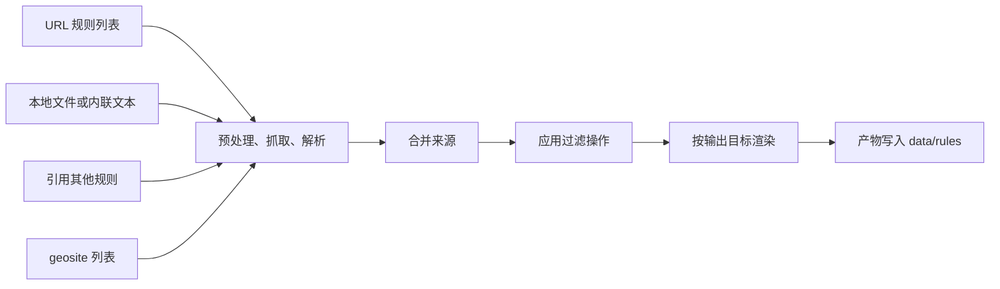

# Proxy Rule Manager

<p align="center">
  
</p>

<p align="center"><em>把多个上游来源的代理规则，编译成各个客户端专用格式。</em></p>

<p align="center">
  <a href="https://go.dev/"></a>
  <a href="https://github.com/fl0w1nd/Proxy-Rule-Manager/actions/workflows/ci.yml"></a>
  <a href="https://github.com/fl0w1nd/Proxy-Rule-Manager/releases"></a>
  <a href="https://github.com/fl0w1nd/Proxy-Rule-Manager/stargazers"></a>
  <a href="https://github.com/fl0w1nd/Proxy-Rule-Manager/commits/main"></a>
</p>

## 目录

- [它是什么](#它是什么)
- [功能特性](#功能特性)
- [工作原理](#工作原理)
- [快速开始](#快速开始)
- [命令](#命令)
- [配置](#配置)
- [产物目录](#产物目录)
- [HTTP 服务](#http-服务)
- [部署](#部署)
- [静态站点](#静态站点)
- [开发](#开发)
- [文档](#文档)

## 它是什么

Proxy Rule Manager（prm）把来自多个上游来源的代理规则，编译成客户端专用格式，支持 Mihomo、sing-box、Surge、Shadowrocket。

你只维护一份规则来源。prm 负责抓取、合并、过滤、渲染，最后写出产物。它既可以当命令行工具用，也可以作为常驻服务定时运行。

## 功能特性

- **多种来源**：远程规则列表、本地文件、内联文本、引用其他规则、geosite 域名库（v2fly、loyalsoldier）。
- **输入解析**：经典行列表和 Mihomo YAML 格式，自动识别。
- **中间表示（IR）**：40 多种规则类型，外加 AND、OR、NOT 逻辑组合。
- **合并策略**：并集（默认）、交集、差集，自动去重。
- **过滤操作（ops）**：按类型保留或移除，按关键词/后缀/前缀/精确/正则过滤值。
- **输出客户端**：Mihomo（Classical、YAML）、sing-box JSON、Surge、Shadowrocket，支持自定义模板。
- **变体**：同一客户端额外产出，渲染前再做一次过滤。
- **geosite 自动发布**：把 provider 的全部列表和属性变体同步到目标客户端。
- **JavaScript 预处理**：解析前可先用脚本改写原始内容。
- **更新历史**：记录每次更新的新增/删除条目样例。
- **调度**：手动、固定间隔或 cron；同一时间只跑一次更新，可取消。
- **HTTP 服务**：公开规则站点 + 带鉴权的管理 API。
- **静态站点导出**：输出到 `dist/`，可托管到 GitHub Pages。

## 工作原理

一条规则就是一个编译单元：声明来源、可选过滤操作、合并策略和输出客户端。执行 `prm update` 时，按依赖顺序编译所有规则并写出产物。



1. **读取来源**。每个来源是远程 URL、本地文件、内联文本、其他规则的引用或 geosite 列表。被引用的规则先编译。可选 JavaScript 脚本能在解析前改写原文。
2. **解析**。解析器把经典行列表和 Mihomo YAML 格式转成中间表示。解析不了的文本会作为诊断信息展示，不会静默丢弃。
3. **合并**。多来源按策略合并：并集（默认）、交集、差集。重复条目消失。
4. **应用过滤**。规则级操作保留或移除条目、过滤值。变体操作在合并结果上再执行一次。
5. **渲染**。每个输出目标用模板渲染中间表示，产物写入 `data/rules/`。

配置示例：

```yaml
clients:
  - id: mihomo
    name: Mihomo
    formats:
      - id: mihomo-classical
        name: Classical
        template: mihomo-classical

rules:
  - id: OpenAI
    name: OpenAI
    sources:
      - url: https://raw.githubusercontent.com/blackmatrix7/ios_rule_script/master/rule/Surge/OpenAI/OpenAI.list
    ops:
      - type: include_kinds
        kinds: [domain, domain_suffix, ip_cidr]
    outputs: [mihomo]
```

每个字段的完整讲解和默认值，见 [docs/configuration.md](docs/configuration.md)。

## 快速开始

1. **获取程序**。从 [Releases 页面](https://github.com/fl0w1nd/Proxy-Rule-Manager/releases) 下载最新发布；或 `make build` 后用 `bin/prm`。用 Docker 就执行 `make docker-build`。
2. **生成配置**。`prm init` 写出一个最小可运行的 `config.yaml`，已有文件时拒绝覆盖。
3. **编辑配置**。`config.yaml` 里声明你的客户端（clients）和规则（rules）。
4. **校验配置**。`prm validate` 通过则继续，报错带 YAML 行号和配置路径。
5. **执行更新**。`prm update` 抓取来源、生成产物，产物出现在 `data/rules/`。

所有命令都支持 `--config PATH` 指定配置文件（默认 `config.yaml`）。访问运行数据的命令支持 `--data-dir PATH`（默认 `./data`，环境变量 `PRM_DATA_DIR`）。

## 命令

| 命令 | 作用 |
| --- | --- |
| `prm init` | 写出示例 `config.yaml` |
| `prm validate` | 校验配置、模板和 geosite 引用 |
| `prm update [rule-ids...]` | 全量更新，或只编译列出的规则及其依赖 |
| `prm preview <rule-id> [--target <id>]` | 查看单条规则各阶段结果，可指定渲染某个输出目标 |
| `prm build` | 全量更新后，把静态站点导出到 `dist/` |
| `prm serve` | 启动 HTTP 服务（需要 `PRM_ADMIN_TOKEN`） |

## 配置

复制 `config.template.yaml` 为 `config.yaml` 后编辑。友好教程见 [docs/configuration.md](docs/configuration.md)，逐字段参考见模板本身。

几个关键约定：

- 字符串支持 `${ENV_NAME}` 环境变量插值，适合放令牌和私有地址。
- 时长用 Go 语法（`30m`、`168h`）；大小可写 `4MB` 或字节数。
- 数据目录和 HTTP 服务参数属于运行时接口，通过 CLI flag 或 `PRM_*` 环境变量设置。
- 本地文件来源只从 `data/local/` 下解析。
- 校验错误带 YAML 行号和配置路径。

## 产物目录

```text
data/
├── rules/
│   ├── mihomo-classical/
│   │   ├── OpenAI.list
│   │   └── geosite/v2fly/google.list
│   └── sing-box-non-ip/
│       └── OpenAI.json
├── local/              # 本地文件来源
├── templates/          # 自定义模板覆盖
├── static/icons/       # 站点图标
├── geosite/            # provider 缓存
└── .state/             # 快照和更新历史
```

## HTTP 服务

`prm serve` 默认监听 `127.0.0.1:3001`，管理令牌通过 `PRM_ADMIN_TOKEN` 提供。运行时参数遵循 CLI flag > 环境变量 > 默认值：

| 用途 | CLI flag | 环境变量 |
| --- | --- | --- |
| 数据目录 | `--data-dir` | `PRM_DATA_DIR` |
| 监听地址 | `--host` | `PRM_SERVE_HOST` |
| 监听端口 | `--port` | `PRM_SERVE_PORT` |
| 可信代理 | 重复 `--trusted-proxy` | `PRM_TRUSTED_PROXIES`（逗号分隔） |

示例：`PRM_ADMIN_TOKEN=secret prm --data-dir ./data serve --host 127.0.0.1 --port 3001`。

- 公开页面 `/` 和 `/index.html`：规则索引、标签筛选、产物下载链接、geosite 目录。
- 规则产物在 `/rules/`。
- 图标在 `/static/icons/`。
- 管理看板在 `/admin`，管理 API 在 `/api/v1`。
- API 端点：`status`、`rules`、`geosite/providers`、`changes`、`updates`（含详情、事件流、取消）。

写操作接口接受 Bearer 令牌，或同源请求携带有效会话 Cookie（HttpOnly + SameSite=Strict）。同一时间只能执行一次更新，期间发起第二次会返回冲突，直到第一次结束。配置了 `interval` 或 `cron` 调度时，`serve` 会自动启动定时器。

## 部署

两种部署方式，按场景选择：

- **自托管**：下载 [Release](https://github.com/fl0w1nd/Proxy-Rule-Manager/releases) 二进制直接运行，或用 Docker Compose 跑 `ghcr.io/fl0w1nd/prm` 镜像。带完整管理能力（`/admin` 看板、API、手动更新、历史查看），适合个人环境。
- **GitHub Pages 静态发布**：Fork 仓库，启用 Actions，在 `publish` 分支维护配置，工作流自动构建并发布规则站。只有公开站点，无管理看板，适合纯只读的公开规则站。

完整步骤：自托管见 [docs/deployment.md](docs/deployment.md)，静态发布见 [docs/github-pages.md](docs/github-pages.md)。

## 静态站点

不用自托管服务器时，`prm build` 可以把规则站导出为独立静态站点：`index.html`、`rules/`、`static/icons/`、`.nojekyll`。导出内容可以用任意静态文件服务器托管，也可以按 README 里的部署章节发布到 GitHub Pages。

## 开发

环境要求：Go 1.25、make。

| 命令 | 作用 |
| --- | --- |
| `make build` | 构建 `bin/prm` |
| `make test` | 运行全部测试（随机顺序 + 覆盖率） |
| `make test-race` | 带竞态检测运行测试 |
| `make lint` | 运行 gofmt、go vet、golangci-lint |
| `make ci` | 本地质量门禁（lint + 竞态测试） |
| `make proto` | 重新生成 geosite 的 protobuf 代码（需要 protoc） |
| `make docker-build` | 构建容器镜像 |
| `make docker-run` | 用 `./data` 和 `config.yaml` 运行容器 |
| `make clean` | 清理 `bin/` |

CI 依次跑 lint、测试、发布二进制构建、容器构建。发布用 goreleaser，容器推送到 `ghcr.io/fl0w1nd/prm`。

## 文档

- [docs/configuration.md](docs/configuration.md)：配置友好教程。
- [docs/deployment.md](docs/deployment.md)：部署指南（自托管、Docker Compose、反向代理）。
- [docs/github-pages.md](docs/github-pages.md)：GitHub Pages 静态发布。
- [config.template.yaml](config.template.yaml)：逐字段参考模板。
